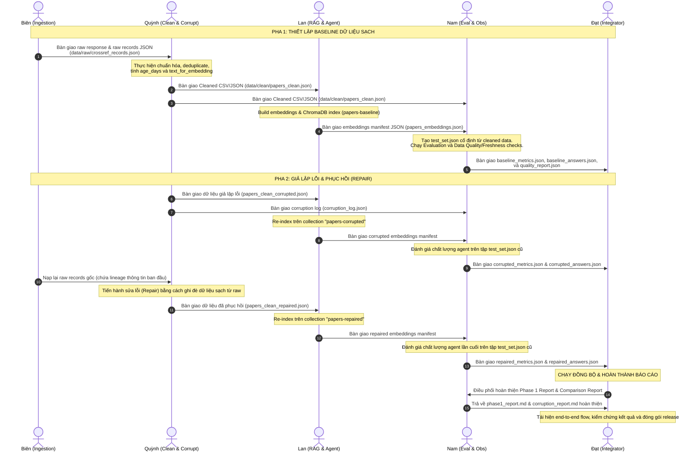

# Báo cáo Checkpoint 0 — Vai trò 1 (Lead / Pipeline Integrator)
**Thành viên thực hiện:** Vũ Nguyễn Quốc Đạt (Role 1)
**Dự án:** Day 10 — Data Pipeline & Data Observability Lab

---

## 1. Chốt phân công vai trò, nhánh Git, và Artifact bàn giao
Để đảm bảo tính nhất quán và độc lập khi làm việc song song, nhóm 5 người thống nhất phân công vai trò, quy ước đặt tên nhánh Git và các artifact bàn giao như sau:

### Phân công chi tiết & Đường dẫn file

| Thành viên | Vai trò | Nhánh Git | File source phụ trách | Artifact bàn giao chính (Đường dẫn tương đối) |
| :--- | :--- | :--- | :--- | :--- |
| **Đạt** | **Role 1: Lead / Pipeline Integrator** | `feature/dat-lead-pipeline` | `src/core/config.py` `src/core/utils.py` `src/pipelines/phase1.py` `src/pipelines/corruption_flow.py` | - `script/run_phase1.py` - `script/run_corruption_flow.py` |
| **Biên** | **Role 2: Ingestion Owner** | `feature/bien-ingest` | `src/ingestion/crossref.py` | - `data/raw/crossref_response.json` - `data/raw/crossref_records.json` |
| **Quỳnh** | **Role 3: Cleaning & Corruption Owner** | `feature/quynh-clean-corruption` | `src/ingestion/cleaning.py` `src/ingestion/corruption.py` | - `data/clean/papers_clean.csv` - `data/clean/papers_clean.json` - `data/clean/papers_clean_corrupted.csv` - `data/clean/papers_clean_repaired.csv` - `data/results/corruption_log.json` |
| **Lan** | **Role 4: RAG & Agent Owner** | `feature/lan-rag-agent` | `src/retrieval/index.py` `src/retrieval/embeddings.py` `src/retrieval/agent.py` `src/retrieval/qa.py` `src/retrieval/llm.py` | - `data/chroma/` - `data/embeddings/papers_embeddings.json` - `data/embeddings/papers_embeddings_corrupted.json` - `data/embeddings/papers_embeddings_repaired.json` |
| **Nam** | **Role 5: Evaluation & Observability** | `feature/nam-eval-observe` | `src/evaluation/testset.py` `src/observability/quality.py` `src/observability/reporting.py` | - `data/eval/test_set.json` - `data/results/*_metrics.json` - `data/results/*_answers.json` - `data/quality/` - `data/reports/phase1_report.md` - `data/reports/corruption_report.md` |

### Tiêu chí hoàn thành (Definition of Done - DoD) cho các Checkpoint
- **Code:** Code chạy không có lỗi biên dịch/runtime, tuân thủ cấu trúc của starter code và không thay đổi chữ ký hàm có sẵn trong core.
- **Không lộ Secret:** Tuyệt đối không commit file `.env` hoặc API keys lên repository.
- **Artifact:** Mọi artifact được sinh ra đúng định dạng (JSON/CSV/MD) và lưu trữ chính xác tại thư mục cấu hình trong `src/core/config.py`.
- **Nhất quan:** Bộ dữ liệu đánh giá (Test Set) được tạo một lần ở baseline và giữ nguyên khi so sánh baseline, corrupted và repaired.

---

## 2. Kiểm tra Môi trường & Cấu hình cục bộ

Dưới sự điều phối của Lead (Đạt), hệ thống môi trường và cấu hình cục bộ đã được kiểm tra và ghi nhận kết quả:

1. **Phiên bản Python:** 
   - Kiểm tra thành công: `Python 3.12.10` (Nằm trong khoảng yêu cầu `3.11` – `3.13`).
2. **Dependencies:**
   - Các gói thư viện cốt lõi đã được cài đặt đầy đủ: `pandas`, `chromadb`, `sentence-transformers`, `torch`, `great-expectations`, `ragas`, `python-dotenv`.
   - Gói cục bộ `src` đã được đăng ký thành công trong môi trường ảo (Editable mode). Import thành công: `import src; print('Import OK')`.
3. **Cấu hình cục bộ (.env):**
   - Đã khởi tạo file `.env` từ `.env.example` tại thư mục gốc của project.
   - *Lưu ý thành viên:* Mỗi thành viên cần tự điền API Key tương ứng với LLM Provider mà mình sử dụng (ví dụ: `GOOGLE_API_KEY` cho Gemini hoặc `OPENAI_API_KEY` cho OpenAI).

---

## 3. Sơ đồ luồng bàn giao dữ liệu (Handoff Flow)

Dưới đây là sơ đồ chi tiết biểu diễn quá trình chuyển giao dữ liệu giữa các vai trò trong nhóm từ lúc lấy dữ liệu từ API Crossref cho đến khi xuất báo cáo so sánh cuối cùng.

---
**Xác nhận mốc CP0:** Đạt (Role 1) đã hoàn thành việc thiết lập hạ tầng dự án, kiểm tra môi trường và thống nhất sơ đồ luồng dữ liệu cùng các thành viên. Sẵn sàng chuyển giao sang Checkpoint 1.
